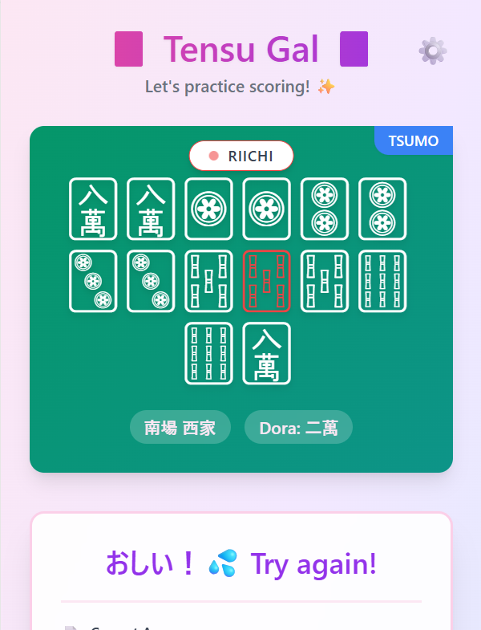

# Minutes Tensu (点数ギャル) 🀄✨

**「麻雀の点数計算、マジでムズくない？」**
そんな悩みを解決する、超キュートで爆速な点数計算練習 Chrome 拡張機能が登場！💖

ギャルエンジニアが作った、見た目もアゲアゲ⤴️なデザインで、楽しく点数計算をマスターしちゃお！


*(※ここにデモ画像を入れる予定だよ！)*

## 🎀 特徴 (Features)

*   **無限・手牌生成**: 毎回ランダムな手牌が生成されるから、飽きずに練習できるよ！
    *   **鳴き対応**: ポン・チー・カンが入った手牌もバッチリ出るし、ちゃんと計算できる！
    *   **リーチ有無**: 門前だけじゃなく、リーチ判断も練習に含まれるよ。
*   **ガチ点数計算クイズ**:
    *   **翻数 (Han)**: 役の数を当ててね！
    *   **符 (Fu)**: 符計算も逃げちゃダメ！細かいところまでチェック。
    *   **点数 (Points)**: 親・子、ツモ・ロンでの支払いを正確に答えよう！
*   **即時フィードバック**: 「おしい！」「よき〜！✨」ってギャルが褒めてくれる（かも？）
*   **詳細な答え合わせ**:
    *   役の内訳、符計算の詳細（暗刻が何符とか）、点数の支払い内訳（1300-2600とか）まで全部見せちゃう！
*   **設定カスタマイズ**:
    *   喰いタン有無
    *   赤ドラ有無
    *   切り上げ満貫など、ルールに合わせて調整OK！

## 🛠️ 技術スタック (Tech Stack)

*   **Framework**: [WXT](https://wxt.dev/) (Web Extension Framework)
*   **UI Library**: [React](https://react.dev/)
*   **Styling**: [Tailwind CSS](https://tailwindcss.com/)
*   **Language**: TypeScript
*   **Mahjong Logic**: [riichi](https://github.com/StartPoly/riichi) (Scoring Library)

## 🚀 始め方 (Getting Started)

開発環境をセットアップして、一緒に開発しよ！

### 前提条件
*   Node.js (v18以上推奨)
*   npm

### インストール

```bash
# リポジトリをクローン
git clone https://github.com/tomo4k1/minutes-tensu.git
cd minutes-tensu

# 依存関係をインストール
npm install
```

### 開発サーバー起動

```bash
npm run dev
```
これだけでChromeが立ち上がって、拡張機能が読み込まれた状態で開発できるよ！便利すぎ〜！🙌

## 📦 インストール方法 (Manual Installation)

ストア以外から手動で入れたい場合は、ビルドして読み込ませてね！

### 1. ビルドする

```bash
# Chrome用
npm run build

# Firefox用
npm run build:firefox
```
ビルドが終わると `.output/` フォルダにファイルができるよ。

### 2. ブラウザに読み込む

#### Chrome (Chromium系) 🟢
1. URLバーに `chrome://extensions` と入力。
2. 右上の「デベロッパーモード」をONにする。
3. 「パッケージ化されていない拡張機能を読み込む」をクリック。
4. `.output/chrome-mv3` フォルダを選択！

#### Firefox 🦊
1. URLバーに `about:debugging` と入力。
2. 左メニューの「この Firefox」をクリック。
3. 「一時的なアドオンを読み込む...」をクリック。
4. `.output/firefox-mv2/manifest.json` ファイルを選択！

## 🧪 テスト (Testing)

手牌生成や点数計算のロジックを確認したい時は、スクリプトを使ってね。

```bash
# (例) 特定のバグ再現スクリプトなど
node scripts/repro_wind_bug.cjs
```

## 📝 ライセンス

MIT License

---
Created with 💖 by Tensu Gal Team
